# ⚽ Football Shot Selection Optimization

This project focuses on improving **shot selection in football** using **data analytics** and **visualization techniques**. By analyzing historical match data, including shot locations, outcomes, and expected goals (xG), the system helps coaches and analysts make smarter, data-backed decisions to enhance scoring efficiency.

The project includes a full **Python-based pipeline** for data extraction, cleaning, transformation, exploratory data analysis (EDA), modeling, and dashboard visualization.

---

## 📌 Project Overview

**Title:**  
**Data-Driven Optimization of Shot Selection in Football: Enhancing Scoring Efficiency Using Analytics and Visualization**

**Objective:**  
To identify high-value shot zones, reduce poor shot decisions, and provide visual insights using expected goals (xG), clustering, and interactive dashboards.

---

## 🛠️ Tools and Technologies Used

| Category         | Tools / Libraries                      |
| ---------------- | -------------------------------------- |
| Programming      | Python                                 |
| Data Handling    | pandas, numpy                          |
| Visualization    | matplotlib, seaborn, mplsoccer, Plotly |
| Machine Learning | scikit-learn (KMeans clustering)       |
| Dashboard        | Streamlit                              |
| Notebook         | Jupyter Notebook                       |
| Data Format      | JSON (StatsBomb Open Data), CSV        |

---

## 🌟 Features

- 📍 **Shot Density Heatmap:** KDE plot showing where shots are most frequently taken.
- 🎯 **Shot Outcome Map:** Distribution of goals, misses, blocks, and saves.
- 📊 **xG Analysis:** Visualize expected goals by outcome, distance, and pressure.
- 🧠 **Clustering:** Group similar shots to identify tactical patterns.
- 📉 **Angle & Distance Insights:** Analyze how shot angle and distance affect xG.
- 📋 **Interactive Dashboard:** Explore data by team or outcome using Streamlit.

---

## 🖼️ Screenshots

## 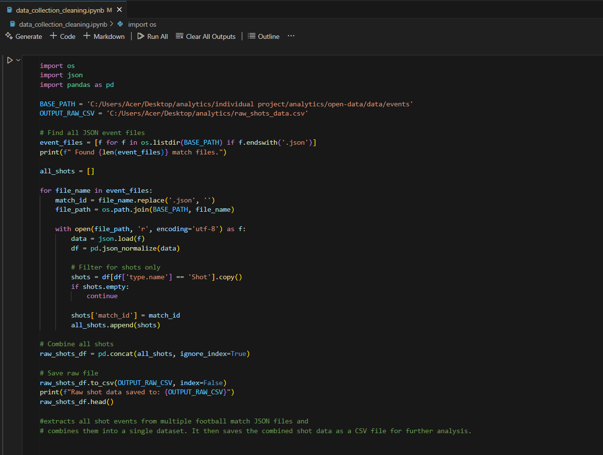

## 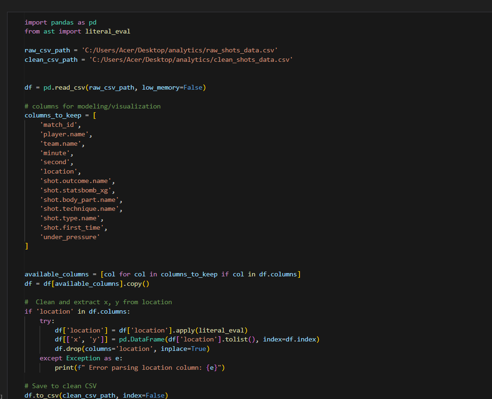

## 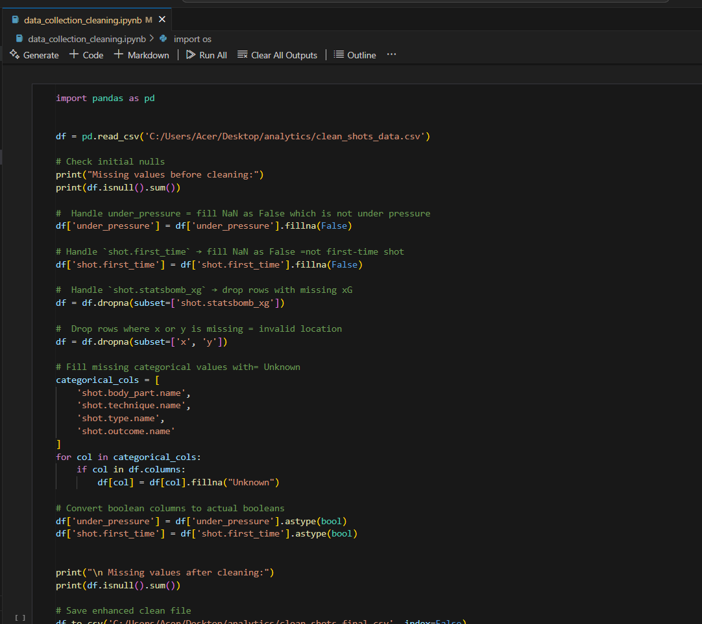

## 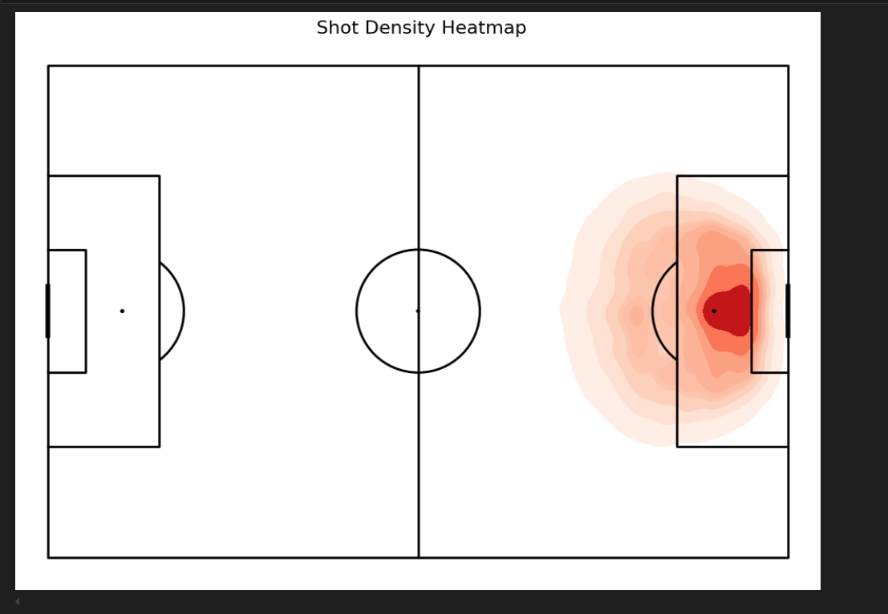

## 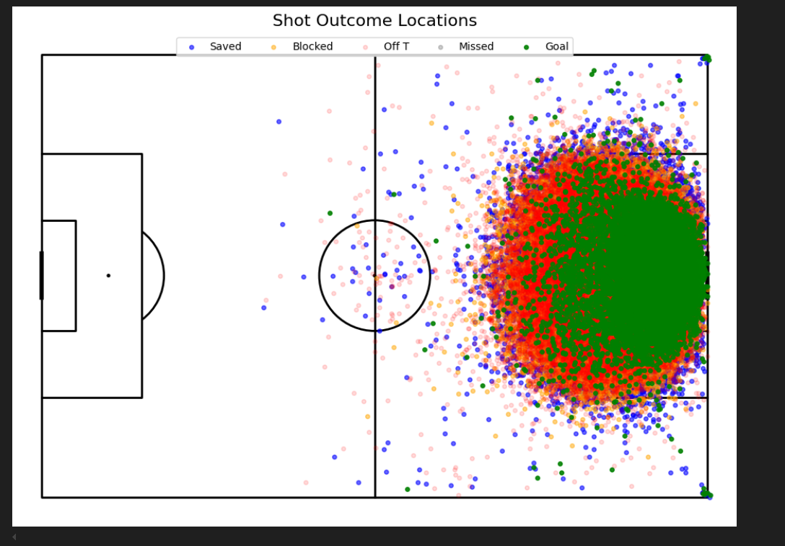

## 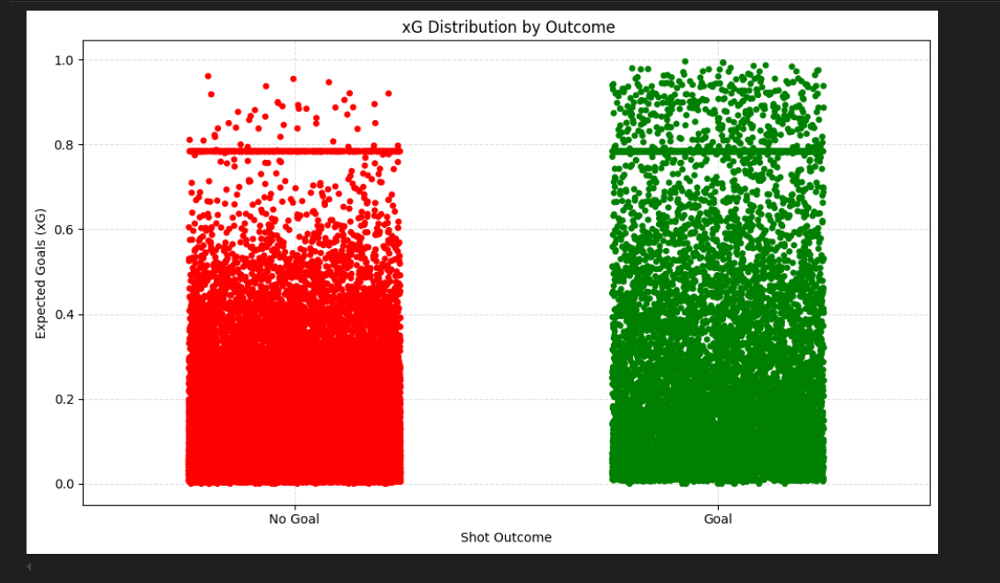

## 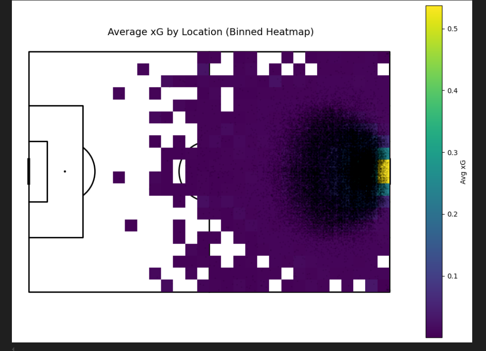

## 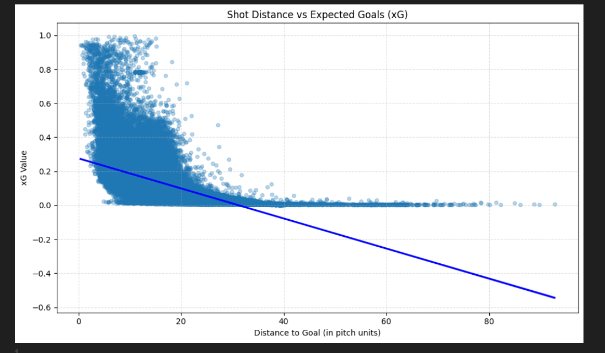

## 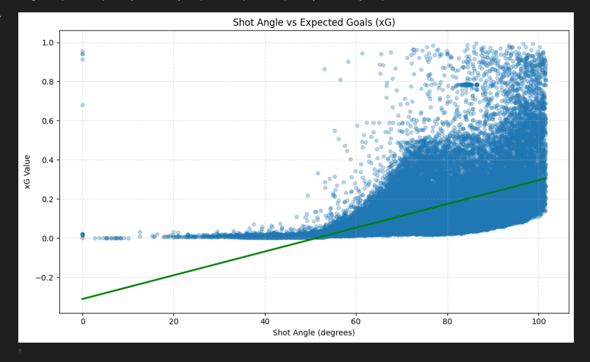

## 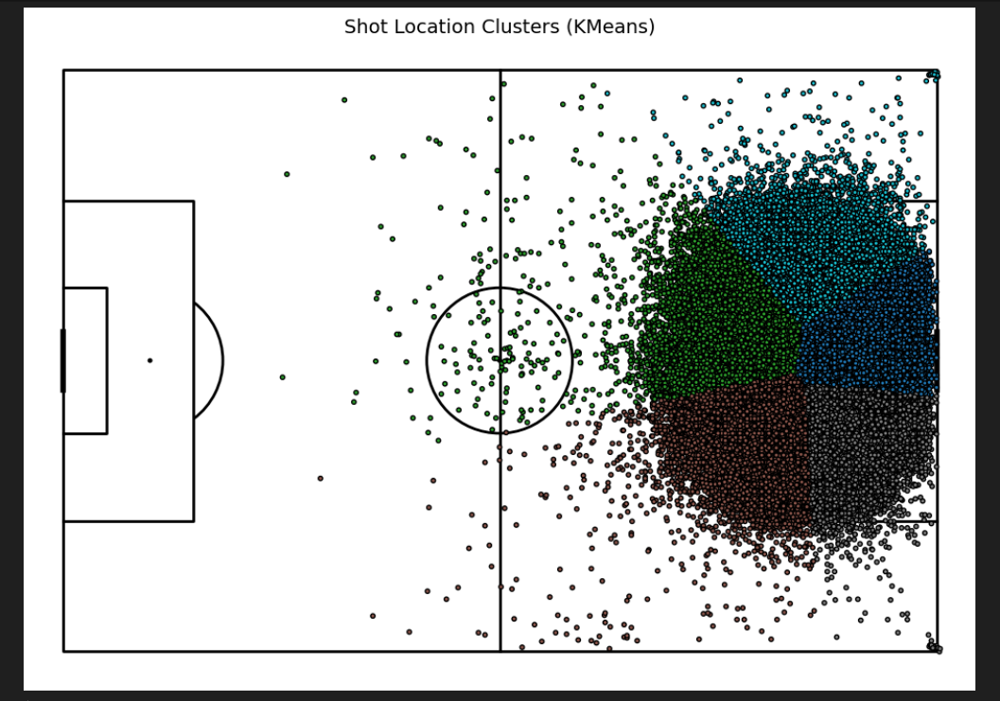

## 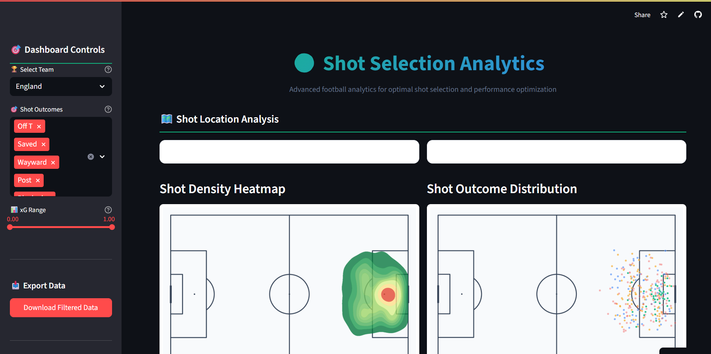

## 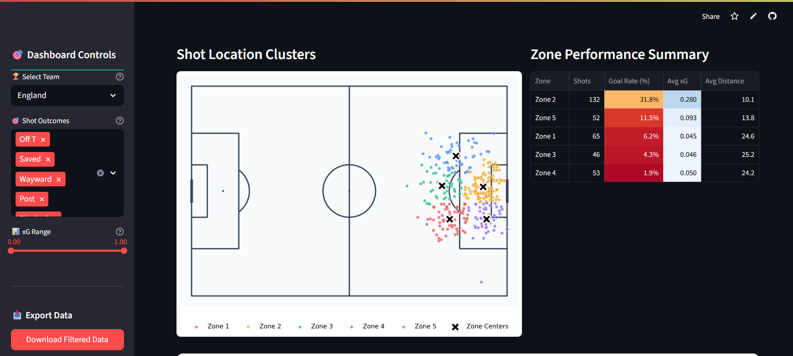

## 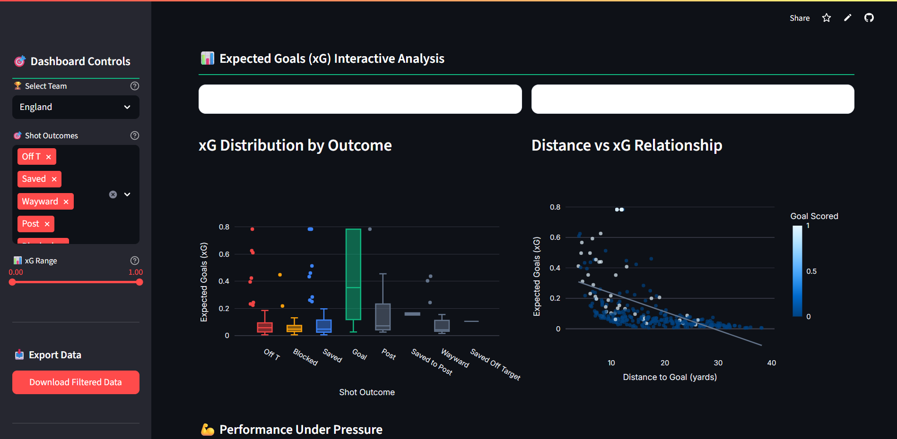

## 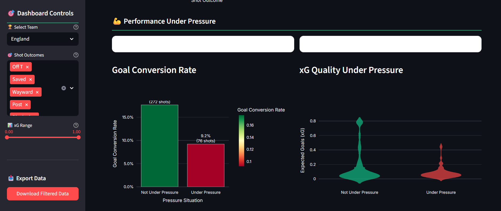

## 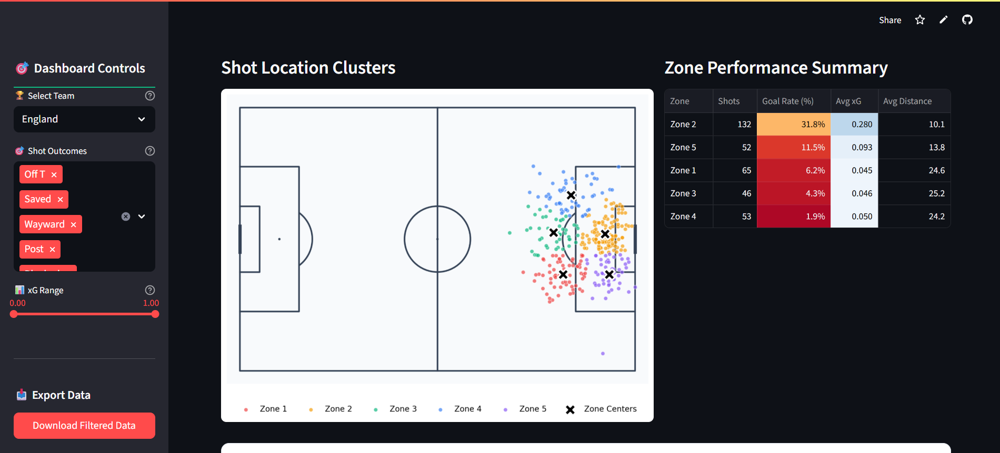

## 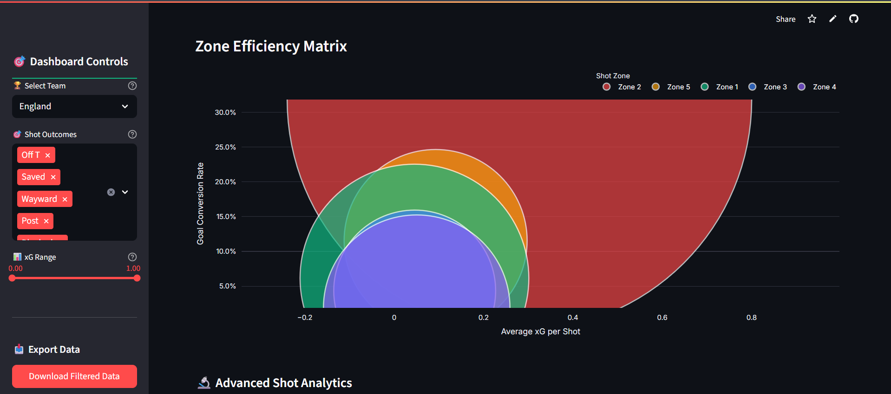

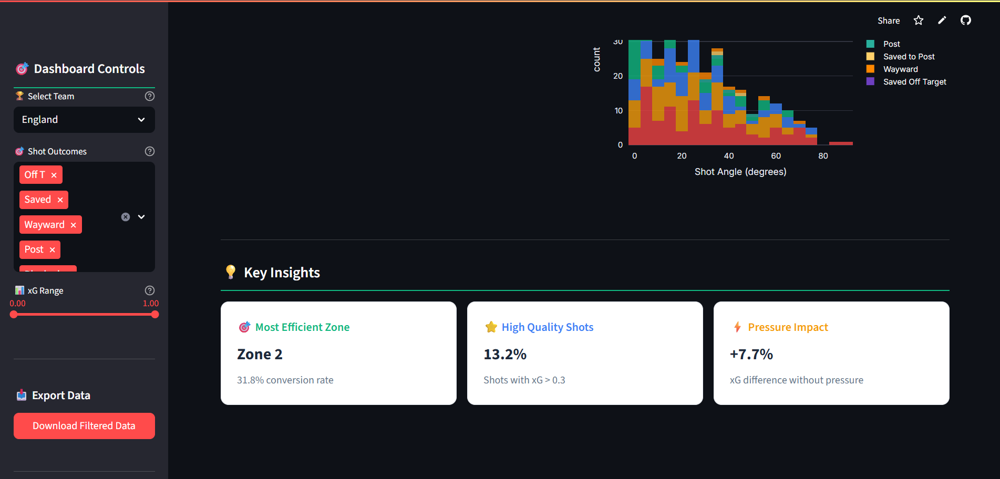

---

## 👨‍💻 Author

**Bibhakta Lamsal**  
Batch 33, Section C  
Softwarica College of IT and E-Commerce

---
